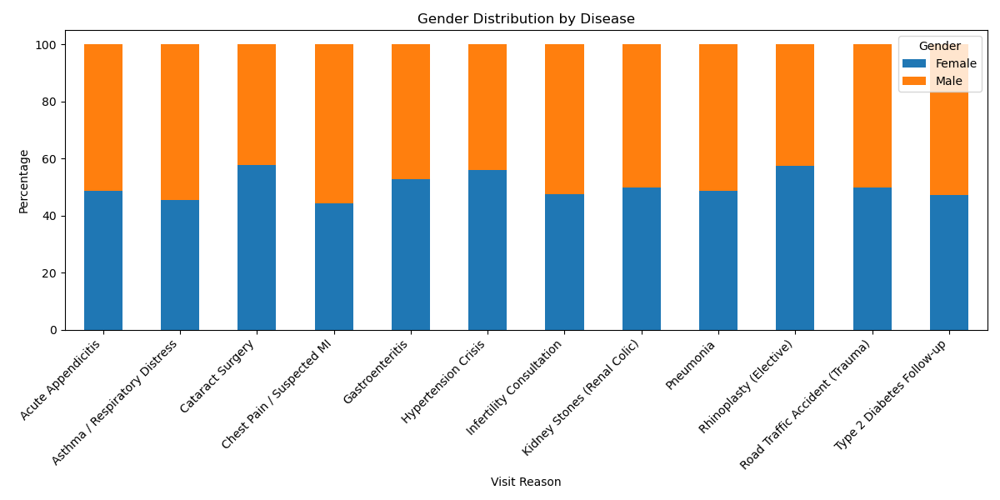

 ## Hospital Patient Data Analysis Portfolio Project

## Project Overview
This project is an exploratory data analysis of a simulated hospital patient dataset from Iran. It was created as part of my personal learning journey in data analytics and Python programming. The dataset contains 1,000 patient records with information such as age, gender, city, department, and visit reason.

Using Python (Pandas and Matplotlib), I analyzed the data to understand patterns in hospital usage and patient demographics. The goal of this project was to practice real-world data analysis skills and to build a portfolio project that demonstrates my ability to work with structured datasets.

---

## Project Goals

The main questions I tried to answer in this analysis were:

- Which cities send the most patients to the hospital?  
- What are the most common reasons for hospital visits?  
- Which age groups use hospital services the most?  
- Are most patients male or female?  
- Which diseases are most common in each age group?  
- Does gender play an important role in certain diseases?

---

## Data Quality Check

Before starting the analysis, I checked the dataset for quality issues:

- **Missing values:** 0  
- **Duplicate rows:** 0  
- All columns were clean and correctly formatted  

This means the dataset was reliable and ready for analysis.

---

## Analysis and Results

### Top 10 Cities by Number of Patients

**Insight**

The analysis shows that most patients come from four major cities:

- Isfahan – 264 patients  
- Mashhad – 261 patients  
- Tehran – 240 patients  
- Shiraz – 235 patients  

This indicates that hospital demand is strongly concentrated in large urban centers. From a practical point of view, this suggests that hospitals in these cities require more medical staff, equipment, and resources to manage higher patient volumes.

---

### Top 10 Visit Reasons

**Insight**

The most common reasons for hospital visits were:

- Hypertension Crisis  
- Gastroenteritis  
- Kidney Stones  
- Asthma / Respiratory Distress  
- Road Traffic Accidents  
- Cataract Surgery  
- Chest Pain / Suspected Heart Attack  
- Infertility Consultation  
- Acute Appendicitis  
- Pneumonia  

This shows a mix of chronic diseases, emergencies, and elective treatments. It highlights the importance of having strong emergency departments as well as specialized care units for cardiovascular and respiratory conditions.

---

### Patient Distribution by Age Group

**Insight**

The age group analysis revealed the following distribution:

- **65+ years – 276 patients**  
- **0–17 years – 196 patients**  
- **18–34 years – 181 patients**  
- **50–64 years – 180 patients**  
- **35–49 years – 167 patients**  

The largest group of patients belongs to the elderly (65+), showing that older people rely most on hospital services. This suggests that hospitals need to focus strongly on geriatric care and chronic disease management.

---

### Gender Distribution

- **Female patients:** 506  
- **Male patients:** 494  

**Insight**

The dataset shows an almost equal gender distribution, with a very small majority of female patients. This means hospital services are used similarly by both genders.

---

## NEW ANALYSIS SECTIONS

### Most Common Disease in Each Age Group

**Insight**

This analysis explored which medical conditions are most common within each age group. The results show a clear relationship between age and type of disease:

- **0–17 years:** Asthma / Respiratory Distress  
- **18–34 years:** Kidney Stones (Renal Colic)  
- **35–49 years:** Asthma / Respiratory Distress  
- **50–64 years:** Hypertension Crisis  
- **65+ years:** Cataract Surgery  

This confirms that different age groups face different health challenges. Younger patients are more affected by respiratory issues, while older patients mainly require treatment for chronic conditions and age-related surgeries.

---

### Gender Importance in Diseases

**Insight**

To understand whether gender plays an important role in specific diseases, I analyzed the gender distribution for each visit reason.

The results show that:

- Some diseases have almost equal male and female representation.  
- Other conditions show noticeable gender differences.  
- For example, kidney stone cases are more common among male patients, while some respiratory and elective procedures show a slight female majority.

This analysis demonstrates that **gender is an important factor for certain diseases, but not for all**. Understanding these patterns can help hospitals plan specialized services more effectively.

---

## Overall Conclusions

From this project, I learned that:

- Most hospital patients come from a few large cities.  
- Chronic conditions and emergencies are the main drivers of hospital visits.  
- Elderly people form the largest patient group.  
- Gender distribution overall is balanced, but some diseases are gender-dependent.  
- There is a strong relationship between age and type of disease.
---

## Final Notes

This project helped me practice essential data analysis skills such as:

- Loading and cleaning datasets  
- Performing descriptive statistics  
- Creating meaningful visualizations  
- Interpreting real-world patterns from structured data  

It represents my first complete portfolio project in Python and data analytics.
